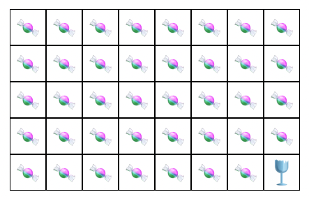

# Chomping Glass

An on-chain game of skill.



## On-chain program

The program is *immutably* deployed to Solana mainnet at the following address:
```
ChompZg47TcVy5fk2LxPEpW6SytFYBES5SHoqgrm8A4D
```

To verify the program's code, use the following command (requires `solana-verify` which can be installed via `cargo install solana-verify`):
```
solana-verify verify-from-repo -um --program-id ChompZg47TcVy5fk2LxPEpW6SytFYBES5SHoqgrm8A4D https://github.com/jarry-xiao/chomping-glass
```